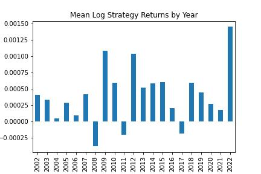
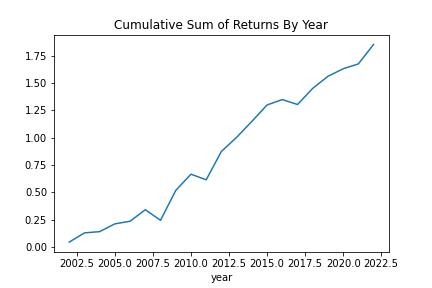

# Evaluate A Real Trading Strategy

Fund managers report their holdings every month. They don’t want to tell investors they lost money on meme stocks. So at the end of the month, they sell low-quality assets and buy high-quality assets, like bonds.

We might be able to take advantage of this by buying bonds at the end of the month and selling them at the beginning of the month.

Why does this work? The edge is probably too messy, too small, or just not interesting to professionals. Which makes it perfect for us.

Most people over-complicate algorithmic trading – it really can be this simple.

Here’s how to investigate this effect with Python, step by step

---

Libraries used:

pandas
numpy
matplotlib
yfinance

---

## Step 1: Get Data

We’ll use the yFinance library to get our data

---

## Step 2: Prepare Data

Add a few columns to the original DataFrame

Compute the log returns then add a column for the calendar day of the month (1 – 31) and a column for the year.

---

## Step 3: Investigate Our Hypothesis

We expect there to be positive returns in TLT toward the end of the month. We expect this because we think fund managers buy TLT at the end of the month. We expect there to be negative returns in TLT toward the beginning of the month. This is when fund managers sell their high-quality assets and go back to buying meme stocks.

To see if this is true, we want the mean return on every day of the month.

We see evidence that returns are positive during the last days of the month and negative during the first.

This is for the entire range of data. Explore the persistence by grouping and averaging returns during different time frames.

---

## Step 4: Build A Simple Trading Strategy

Build a naive strategy to test our hypothesis:

Buy and hold TLT during the last week of the month
Short and hold TLT during the first week of the month
Simple.

This code creates 3 new columns:

- first_week_returns – the daily log return if it’s between the 1st and 7th day of the month, otherwise 0

- last_week_returns – the daily log return if it’s on or after the 23rd day of the month, otherwise 0

- last_week_less_first_week – the difference between last_week_returns and first_week_returns
last_week_less_first_week represents the returns from our naive strategy. It’s basically saying “go long TLT the last week” and “go short TLT the first week”.

---

## Step 5: Plot Returns

Create a naive backtest of our naive strategy to get a feel for the returns.

The point of this is not to have a highly accurate, statistically significant backtest. It’s to spend the shortest amount of time possible to see if this strategy is worth pursuing in more detail.

---

**Mean log returns by year**

We see more evidence that this effect is persistent through time. Since 2002, there have only been 3 years where returns are negative.

---

**Cumulative returns by year**

---

**Cumulative returns by day**

There’s evidence that this effect is profitable. It’s worth spending more time exploring it more deeply.